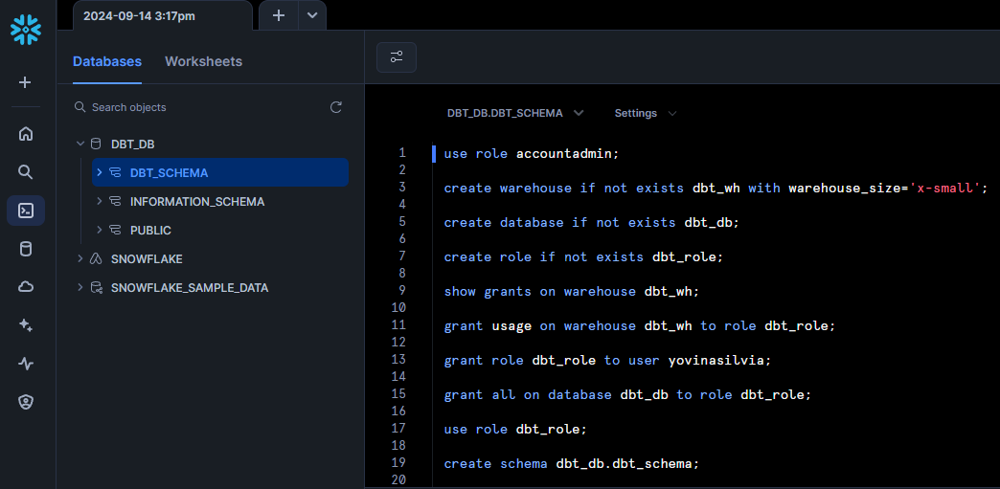
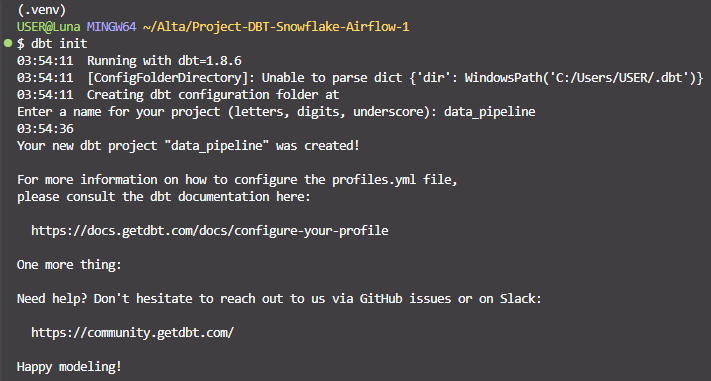
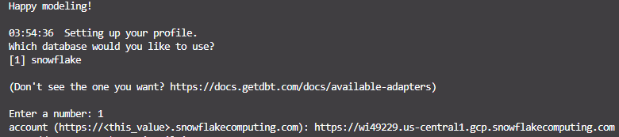
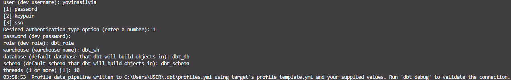
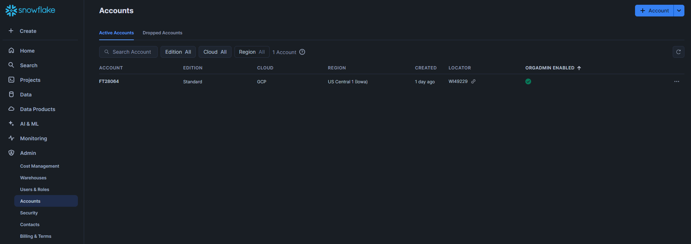

# Building an ELT Pipeline: Integrating Snowflake, DBT, and Airflow for Data Transformation

## The tools used in the ELT pipeline process are:
* Snowflake: Used as both the data source and the data warehouse. It handles the storage and initial loading of data.
* Airflow: Used for orchestration and automation of the ELT workflow, managing the scheduling and execution of tasks in the pipeline.
* DBT (Data Build Tool): Used for data transformation, cleaning, and modeling. It transforms raw data in the data warehouse into a format ready for analysis.

## PART 1: Set Up Environment in Snowflake
### Set the Role to ACCOUNTADMIN:
```
use role accountadmin;
```
This sets the role used to ACCOUNTADMIN, which is the role with the highest level of access in Snowflake.
### Create the Warehouse:
```
create warehouse if not exists dbt_wh with warehouse_size='x-small'; 
```
Creates a warehouse named dbt_wh with an x-small size if it does not already exist.
### Create the Database:
```
create database if not exists dbt_db;
```
### Create the Role:
```
create role if not exists dbt_role;
```
Creates a role named dbt_role if it does not already exist. The role is used to manage user access permissions in Snowflake.
### Show Grants on the Warehouse:
```
show grants on warehouse dbt_wh;
```
This helps verify who has access to the dbt_wh warehouse.
### Grant Usage Rights on the Warehouse to the Role:
```
grant usage on warehouse dbt_wh to role dbt_role;
```
Grants usage rights for the dbt_wh warehouse to the dbt_role role.
### Grant the Role to the User:
```
grant role dbt_role to user "yovinasilvia";
```
Grants the dbt_role role to the user named yovinasilvia.
### Grant All Permissions on the Database to the Role:
```
grant all on database dbt_db to role dbt_role;
```
Grants all permissions on the dbt_db database (such as SELECT, INSERT, UPDATE, DELETE) to the dbt_role role.
### Change the Current Role to dbt_role:
```
use role dbt_role;
```
Changes the current role to dbt_role, so that subsequent commands are executed with the permissions granted to this role.
### Create the Schema:
```
create schema dbt_db.dbt_schema;
```
Creates a schema named dbt_schema within the dbt_db database. The schema is used to organize tables and other objects within the database.
### The display and result in Snowflake are as follows:


## PART 2: Setup DBT Project

### Create Project Directory
Create a folder for our project; here, I named the project Project-Snowflake-DBT-Airflow
```
mkdir Project-Snowflake-DBT-Airflow
```
### Create and activate a virtual environment
Move to Project-Snowflake-DBT-Airflow directory and create and activate virtual environment
```
cd Project-Snowflake-DBT-Airflow
python -m venv .venv
source .venv/Scripts/activate
```
### Install and Setup dbt
Install dbt-snowflake
```
pip install dbt-snowflake
```
And also install dbt-core
```
pip install dbt-core
```

### Create and Setup DBT Project
To create a dbt project, use dbt init. Here, we name our project data_pipeline. Run the following command:
```
dbt init data_pipeline
```
After that you will get some questions like the following picture:






Change to the data_pipeline directory.
```
cd data_pipeline
```

## PART 3: Setup DBT Profile
By default, DBT will create a dbt profile at your home directory `~/.dbt/profiles.yml`
You can update the profiles, or you can make a new dbt-profile directory.
To make a new dbt-profie directory, you can invoke the following:
```
mkdir dbt-profiles
touch dbt-profiles/profiles.yml
export DBT_PROFILES_DIR=$(pwd)/dbt-profiles
```

Set profiles.yml as follow:
```
data_pipeline:
  target: dev
  outputs:
    dev:
      type: snowflake
      account: wi49229.us-central1.gcp # use your account locator
      user: yovinasilvia # change it to your username
      password: "{{ env_var('SNOWFLAKE_PASSWORD') }}" 
      role: dbt_role
      database: dbt_db
      warehouse: dbt_wh
      schema: dbt_schema
      threads: 10
      client_session_keep_alive: False
```



To find the account locator, navigate to the Admin section, then click on Accounts. Copy the locator shown in the locator section. For example, my account locator is: `https://wi49229.us-central1.gcp.snowflakecomputing.com`. 
You should enter it in the profiles.yml file under the locator section like this: `wi49229.us-central1.gcp`

And in the terminal, you can type the following:
```
export SNOWFLAKE_PASSWORD=<insert_your_actual_password>
```
Then, in the `profiles.yml`, you can enter your password as shown in the profiles.yml above like this one `password: "{{ env_var('SNOWFLAKE_PASSWORD') }}"`

## PART 4: Configure dbt_project.yml and Packages
Setting Up DBT Project Configuration in dbt_project.yml
```
models:
  data_pipeline:
    # Config indicated by + and applies to all files under models/example/
    staging:
      +materialized: view
      snowflake_warehouse: dbt_wh
    marts:
      +materialized: table
      snowflake_warehouse: dbt_wh
```
Install dbt-utils for Generic Testing 
1. Create a packages.yml file in your project.
    ```
    touch packages.yml
    ```

2. Add the following code in packages.yml: 
    ```
    packages:
    - package: dbt-labs/dbt_utils
      version: 1.3.0
    ```
3. Run `dbt deps` in your terminal to download and install the dependencies specified in packages.yml for your DBT project.

## PART 5: Create Source and Staging Tables
1. Create a `staging` folder inside the `models` directory.
2. Inside the `staging` folder, create the files: `tpch_source.yml`, `stg_tpch_orders.sql`, and `stg_tpch_line_items.sql`.

Modify `tpch_source.yml`
```
version: 2

sources:
  - name: tpch
    database: snowflake_sample_data
    schema: tpch_sf1
    tables:
      - name: orders
        columns:
          - name: o_orderkey
            data_tests:
              - unique
              - not_null
      - name: lineitem
        columns:
          - name: l_orderkey
            data_tests:
              - relationships:
                  to: source('tpch', 'orders')
                  field: o_orderkey

```

Modify `stg_tpch_orders.sql`
```
select 
    o_orderkey as order_key,
    o_custkey as customer_key,
    o_orderstatus as status_code,
    o_totalprice as total_price,
    o_orderdate as order_date
from {{ source('tpch', 'orders') }}
```

Modify `stg_tpch_line_items.sql`
```
select 
    {{
        dbt_utils.generate_surrogate_key([
            'l_orderkey',
            'l_linenumber'
        ])
    }} as order_item_key,
    l_orderkey as order_key,
    l_partkey as part_key,
    l_linenumber as line_number,
    l_quantity as quantity,
    l_extendedprice as extended_price,
    l_discount as discount_percentage,
    l_tax as tax_rate
from 
    {{ source('tpch', 'lineitem') }}
```

## PART 6: Create Transformed Models (Fact Tables, Data Marts)
1. Create a folder named `marts` inside the models directory.
2. Inside the `marts` folder, create the files: `int_order_items.sql`, `int_order_items_summary.sql`, and `fct_orders.sql`.

Modify `int_order_items.sql`
```
select 
    line_item.order_item_key,
    line_item.part_key,
    line_item.line_number,
    line_item.extended_price,
    orders.order_key,
    orders.customer_key,
    orders.order_date,
    {{ discounted_amount('line_item.extended_price', 'line_item.discount_percentage')}} as item_discount_amount
from 
    {{ ref('stg_tpch_orders') }} as orders 
join
    {{ ref('stg_tpch_line_items') }} as line_item  
        on orders.order_key = line_item.order_key
order by
    orders.order_date
```

Modify `int_order_items_summary.sql`
```
select
    order_key,
    sum(extended_price) as gross_item_sales_amount,
    sum(item_discount_amount) as item_discount_amount
from
    {{ ref('int_order_items') }}
group by
    order_key
```

Modify `fct_orders.sql`
```
select
    orders.*,
    order_item_summary.gross_item_sales_amount,
    order_item_summary.item_discount_amount
from
    {{ ref('stg_tpch_orders') }} as orders 
join
    {{ ref('int_order_items_summary') }} as order_item_summary 
        on orders.order_key = order_item_summary.order_key
order by order_date
```

## PART 7: Create Macros to Keep Code D.R.Y (Don’t Repeat Yourself)
Macros are used to write reusable SQL code that can be applied across multiple models or other parts of your DBT project, reducing code duplication and making the project more manageable.

1. In the `macros` folder, create a file named `pricing.sql`.
```

    (-1 * {{ extended_price }} * {{discount_percentage}})::decimal(16, {{ scale }})

```

## PART 8: Create Generic and Singular Tests
### Generic Tests
In the models/marts folder, create a file named `generic_tests.yml`.
```
models:
  - name: fct_orders
    columns:
      - name: order_key
        tests:
          - unique
          - not_null
          - relationships:
              to: ref('stg_tpch_orders')
              field: order_key
              severity: warn
      - name: status_code
        tests:
          - accepted_values:
              values: ['P', 'O', 'F']
```

### Singular tests
1. In the `tests` folder, add a file named `fct_orders_discount.sql`.
```
select
    *
from
    {{ref('fct_orders')}}
where
    item_discount_amount > 0
```
2. In the `tests` folder, add a file named `fct_orders_date_valid.sql`.
```
select 
    *
from
    {{ref('fct_orders')}}
where
    date(order_date) > CURRENT_DATE()
    or date(order_date) < date('1990-01-01')
```

### Run and Test the Models
Run the following command to execute the models and perform tests:
```
dbt run && dbt test
```


