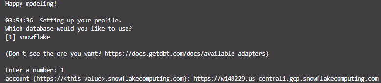

# Building an ELT Pipeline: Integrating Snowflake, DBT, and Airflow for Data Transformation

## The tools used in the ELT pipeline process are:
* Snowflake: Used as both the data source and the data warehouse. It handles the storage and initial loading of data.
* Airflow: Used for orchestration and automation of the ELT workflow, managing the scheduling and execution of tasks in the pipeline.
* DBT (Data Build Tool): Used for data transformation, cleaning, and modeling. It transforms raw data in the data warehouse into a format ready for analysis.

## Step 1: Set Up Environment in Snowflake
### Set the Role to ACCOUNTADMIN:
```
use role accountadmin;
```
This sets the role used to ACCOUNTADMIN, which is the role with the highest level of access in Snowflake.
### Create the Warehouse:
```
create warehouse if not exists dbt_wh with warehouse_size='x-small'; 
```
Creates a warehouse named dbt_wh with an x-small size if it does not already exist.
### Create the Database:
```
create database if not exists dbt_db;
```
### Create the Role:
```
create role if not exists dbt_role;
```
Creates a role named dbt_role if it does not already exist. The role is used to manage user access permissions in Snowflake.
### Show Grants on the Warehouse:
```
show grants on warehouse dbt_wh;
```
This helps verify who has access to the dbt_wh warehouse.
### Grant Usage Rights on the Warehouse to the Role:
```
grant usage on warehouse dbt_wh to role dbt_role;
```
Grants usage rights for the dbt_wh warehouse to the dbt_role role.
### Grant the Role to the User:
```
grant role dbt_role to user "yovinasilvia";
```
Grants the dbt_role role to the user named yovinasilvia.
### Grant All Permissions on the Database to the Role:
```
grant all on database dbt_db to role dbt_role;
```
Grants all permissions on the dbt_db database (such as SELECT, INSERT, UPDATE, DELETE) to the dbt_role role.
### Change the Current Role to dbt_role:
```
use role dbt_role;
```
Changes the current role to dbt_role, so that subsequent commands are executed with the permissions granted to this role.
### Create the Schema:
```
create schema dbt_db.dbt_schema;
```
Creates a schema named dbt_schema within the dbt_db database. The schema is used to organize tables and other objects within the database.
### The display and result in Snowflake are as follows:


## Step 2: Setup DBT Project

### Create Project Directory
Create a folder for our project; here, I named the project Project-Snowflake-DBT-Airflow
```
mkdir Project-Snowflake-DBT-Airflow
```
### Create and activate a virtual environment
Move to Project-Snowflake-DBT-Airflow directory and create and activate virtual environment
```
cd Project-Snowflake-DBT-Airflow
python -m venv .venv
source .venv/Scripts/activate
```
### Install and Setup dbt
Install dbt-snowflake
```
pip install dbt-snowflake
```
And also install dbt-core
```
pip install dbt-core
```

### Create and Setup DBT Project
To create a dbt project, use dbt init. Here, we name our project data_pipeline. Run the following command:
```
dbt init data_pipeline
```
After that you will get some questions like the following picture:





Change to the data_pipeline directory.
```
cd data_pipeline
```

## Step 3: Setup DBT Profile
By default, DBT will create a dbt profile at your home directory `~/.dbt/profiles.yml`
You can update the profiles, or you can make a new dbt-profile directory.
To make a new dbt-profie directory, you can invoke the following:
```
mkdir dbt-profiles
touch dbt-profiles/profiles.yml
export DBT_PROFILES_DIR=$(pwd)/dbt-profiles
```

Set profiles.yml as follow:
```
data_pipeline:
  target: dev
  outputs:
    dev:
      type: snowflake
      account: wi49229.us-central1.gcp # use your account locator
      user: yovinasilvia # change it to your username
      password: "{{ env_var('SNOWFLAKE_PASSWORD') }}" 
      role: dbt_role
      database: dbt_db
      warehouse: dbt_wh
      schema: dbt_schema
      threads: 10
      client_session_keep_alive: False
```


To find the account locator, navigate to the Admin section, then click on Accounts. Copy the locator shown in the locator section. For example, my account locator is: `https://wi49229.us-central1.gcp.snowflakecomputing.com`. 
You should enter it in the profiles.yml file under the locator section like this: `wi49229.us-central1.gcp`

And in the terminal, you can type the following:
```
export SNOWFLAKE_PASSWORD=<insert_your_actual_password>
```
Then, in the `profiles.yml`, you can enter your password as shown in the profiles.yml above like this one `password: "{{ env_var('SNOWFLAKE_PASSWORD') }}"`


